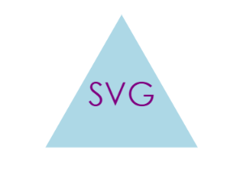

# SVG-Logo-Maker

## Description

The SVG logo maker is part of Object Oriented Programming, that is built using Node.js that will take in user input to generate a logo by color, shape, and text within the shape. This logo will be designed by the user using Node.js and Inquirer. 

## Table of Contents

- [Description](#description)
- [Visuals](#visuals)
- [Installation](#installation)
- [Usage](#usage)
- [Dependencies](#dependencies)
- [Test](#test)
- [License](#license)
- [Questions](#questions)

## Visuals

#### Click on the image below to reveal the video walk-through/demonstration:

## Installation

#### How to install the application:

- First, clone the git repository from [GitHub](git@github.com:kwaters3/SVG-Logo-Maker.git)

- Next, install the required packages by using the following command: `npm install`

- Then, invoke the application by using the following command: `npm start` 

- Finally, the user will have access to the SVG Logo Maker to specially craft and design their own logo. 

## Usage

#### How to use the application:

- First, install the given application/project/dependecies.

- Next, the command-line application will prompt the user with the following: `choose a shape [Triangle, Circle, Square]`, `Enter 3 character text`, `Choose text color`, & `Choose shape background color`.

- Finally, when the command-prompts are complete, `Generated logo.svg` will appear in the console and your new SVG logo will be available in the newly generated SVG file. 

## Dependencies

- [inquirer](https://www.npmjs.com/package/inquirer/v/8.2.4)
- [jest](https://www.npmjs.com/package/jest)

## Test

To run unit testing, open the terminal, and the use the command: `npm run test`.
 There is currently one test suite, testing for 3 structures/tests. 

## License

This project is covered under the following license: 

## Questions

If you have any questions, please email me at: knickler3@gmail.com  
My GitHub page is: [kwaters3](https://github.com/kwaters3)
